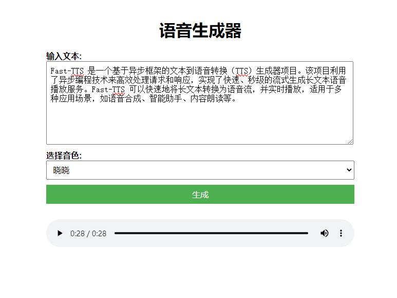

# Fast-TTS

Fast-TTS 是一个基于异步框架的文本到语音转换（TTS）生成器项目。该项目利用了异步编程技术来高效处理请求和响应，实现了快速、秒级的流式生成长文本语音播放服务。Fast-TTS 可以快速地将长文本转换为语音流，并实时播放，适用于多种应用场景，如语音合成、智能助手、内容朗读等。

## 特性

- **异步处理**：使用异步框架和函数来高效处理HTTP请求。
- **支持多种语言和声音**：通过微软TTS服务，支持多种语言和声音选项。
- **简单易用的API**：提供简洁的API接口，便于集成和扩展。
- **实时语音生成**：快速响应生成音频内容，适用于实时应用场景。

## 截图

### 主界面


## 安装

1. 克隆仓库：
    ```bash
    git clone https://github.com/donzell888/fast-tts
    cd fast-tts
    ```

2. 安装依赖：
    ```bash
    pip install -r requirements.txt
    ```

## 使用

1. 启动服务：
    ```bash
    python server.py
    ```

2. 访问主页：
    打开浏览器并访问 `http://127.0.0.1:5000/`。

3. API端点：

    - **生成TTS音频**：
        ```http
        POST /generate
        ```

        **请求体**：文本数据（将转换为语音）
        
        **响应**：包含音频URL的JSON对象
   
## 演示站点

体验 Fast-TTS 的功能，请访问我们的在线演示站点：

[演示站点](http://vps.donzell.cn/fast-tts)

## API示例

### POST /generate

请求示例：
```http
POST /generate HTTP/1.1
Host: 127.0.0.1:5000
Content-Type: application/json

{
    "content": "你好，世界！",
    "voice": "zh-CN-XiaoxiaoNeural"
}